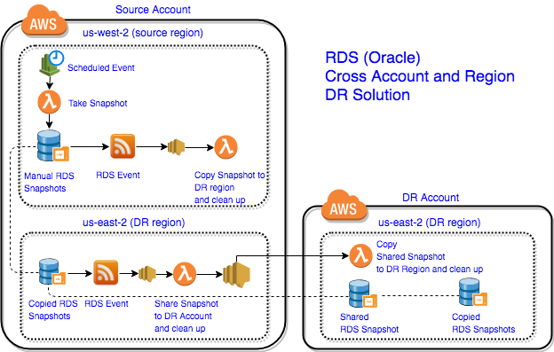
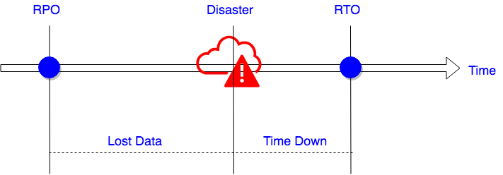
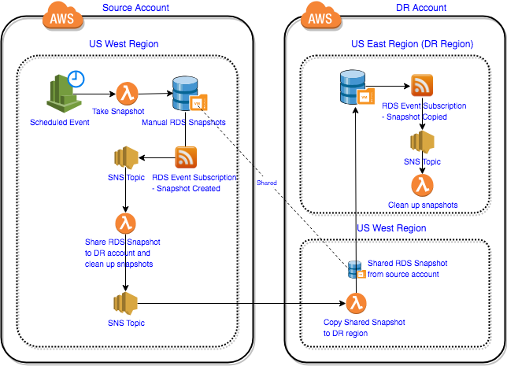

# Cross-Account and Cross-Region Disaster Recovery (DR) for RDS Oracle Database

You can never be too careful to protect your database. This solution will provide your Oracle instances with automatically snapshots backup to another account and another region, so your database can survive from an AWS region failure or account being compromised.

## Solution Overview

Amazon RDS allows you to [share manual Amazon RDS DB snapshots with another AWS account (DR Account)](https://docs.aws.amazon.com/AmazonRDS/latest/UserGuide/USER_ShareSnapshot.html), so the DR account can restore from the snapshot directly or copy it over to same region or to different regions for further backup. This is a really cool feature which makes cross-account backups much easier to be implemented, however, every feature comes with limitations, here is the one that may affect the DR solution you choose:

**"When sharing manual snapshots with other AWS accounts, you cannot share a DB snapshot that uses an option group with permanent or persistent options".**

This means if you set up options such as Transparent Data Encryption (TDE) and Timezone in the option group of the Oracle instance, then you cannot share the snapshots of this instance with other accounts.

This DR solution does take this limitation into consideration and provide a workaround about it. Here are items that the solution automates for you:

* In the source account:
    * Take snapshots automatically based on the user-defined schedule
    * Copy the snapshots to a different region (the DR Region)
* Share the snapshots with another account (DR Account) which has more strict access control
* Clean up the old snapshots on both accounts based on the user-defined snapshot_retention_number



1. In source account, source region, we use a scheduled CloudWatch event to trigger a lambda function to create manual snapshot automatically. Then we use an RDS event to capture the snapshot copied event and copy the new snapshot to DR region (source account).

1. In source account, target region, we use an RDS event to monitor any newly copied manual snapshot with "dr=true" tag and share them to the DR account, DR region. After it was shared, the lambda function will trigger an SNS event and invoke a lambda function in DR account (DR region) to copy the shared snapshot from source account to DR account.

1. Snapshots in all regions will be cleaned up automatically based on the parameters set by user.

## Deploy the Solution

* Prerequisites: [aws cli](https://aws.amazon.com/cli/), [jq](https://stedolan.github.io/jq/)

* Clone the [solution](https://github.com/1Strategy/rds-oracle-cross-account-cross-region-dr)
* Open file rds_dr_deploy.sh, set up below parameters

| Parameters                                            | Details                                                    | Default Value |
| ----------------------------------------------------- |:-----------------------------------------------------------|:--------------|
|source_region                                          | Source region of the Primary RDS instance                  | us-west-2     |
|target_region                                          | DR region of the snapshot backups                          | us-east-2     |
|target_account_id                                      | DR account id of the snapshot backups                      | N/A           |
|source_profile                                         | The name of the source AWS account profile                 | N/A           |
|target_profile                                         | The name of the DR AWS account profile                     | N/A           |
|source_account_source_region_stack_name                | cfn name of the source account source region               | N/A           |
|source_account_source_region_snapshot_retention_number | snapshot retention number for source account source region | N/A           |
|source_account_target_region_stack_name                | cfn name of the source account dr region                   | N/A           |
|source_account_target_region_snapshot_retention_number | snapshot retention number for source account target region | N/A           |
|dr_account_target_region_stack_name                    | cfn name of the dr account dr region                       | N/A           |
|dr_account_target_region_snapshot_retention_number     | snapshot retention number for DR account target region     | N/A           |
|snapshot_frequency                                     | Frequency of taking snapshots                              | rate(1 hour)  |

* Execute the shell script in cmd line:

```bash
./rds_dr_deploy.sh
```

* Add Tag "dr: true" on the RDS instances which need to be backup. (Note: please check and make sure "Copy tags to snapshots" is set to "Yes" in the RDS instance)

* Turn on the CloudWatch event once the solution is deployed, it is disabled by default.

Done!
And now the snapshots of your Oracle instance is regularly generated and cleaned.

## RPO and RTO
RTO and RPO are key considerations when building your disaster recovery solution. Here is a quick concept recap:
* [Recovery point objective (RPO)](https://en.wikipedia.org/wiki/Recovery_point_objective) - The acceptable amount of data loss measured in time. 
* [Recovery time objective (RTO)](https://en.wikipedia.org/wiki/Recovery_time_objective) - The time it takes after a disaster happens to restore a business process to its service level.


For this solution, you can control the RPO by defining parameter **snapshot_frequency** in the rds_dr_deploy.sh, please be aware that the cost of the solution will increase as the snapshot frequency increases.

As for the RTO, the solution doesn't provide features to auto-detect the RDS instance failure and auto-restore from snapshot, so the whole restore process is manual. The time it takes to recover the RDS instance from a snapshots depends on how fast you react to the failure and the size of your database.  

## If you don't need to consider the option group limitation

If don't have the option group limitation in your scenario, you can share the snapshot with DR account as soon as the snapshot is generated, and then copy the snapshot to the DR region. This will save you one round of copy and make the solution more efficient and cost effective.

Here is an overview of this simplified design that you can tailer to meet your needs.


## Conclusion

This post provides a fully automated solution which solves the problem that the oracle instance snapshots cannot be shared with other accounts once the parameter group with permanent or persistent options are set on the instance. You can find the source code for this solution on [github](https://github.com/1Strategy/rds-oracle-cross-account-cross-region-dr).

Hope you found this blog post useful and feel free to contact us if you need any support.